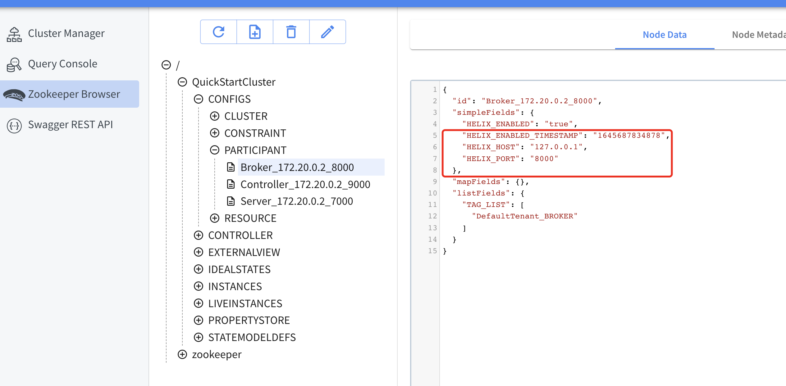

# pinot jdbc 

## do some fix (maybe do more change)

pinot-clients/pinot-jdbc-client/src/main/java/org/apache/pinot/client/base/AbstractBaseConnection.java
```java

@Override
public int getTransactionIsolation()
        throws SQLException {
        return -1;
        }

@Override
public void setTransactionIsolation(int level)
        throws SQLException {
        }

@Override
public boolean getAutoCommit()
        throws SQLException {
        return true;
        }

@Override
public void clearWarnings()
        throws SQLException {
        }

@Override
public void commit()
        throws SQLException {
        }

```

## running

> with jdbc maybe chang  zookeeper info


